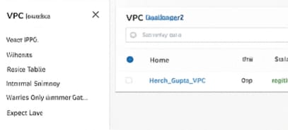

# Task 1 - Networking & Subnetting (AWS VPC Setup)

## 📘 Approach & Design Explanation

I designed a highly available, multi-tier network architecture following AWS best practices:

- Created a single VPC with CIDR `10.0.0.0/16` to allow multiple /24 subnets.
- Configured 2 public and 2 private subnets across two Availability Zones for high availability.
- Attached an Internet Gateway (IGW) to enable internet access for public subnets.
- Deployed a NAT Gateway inside a public subnet to allow private subnets outbound internet access.
- All resources are created using Terraform with prefix `Harsh_Gupta_`.

---

## 🧩 CIDR Ranges Used

| Component              | CIDR Range     | Reason |
|-----------------------|----------------|--------|
| **VPC**               | `10.0.0.0/16`  | Large scalable private block |
| **Public Subnet 1**   | `10.0.0.0/24`  | Easy segmentation, AZ-1 |
| **Public Subnet 2**   | `10.0.1.0/24`  | Mirror for HA, AZ-2 |
| **Private Subnet 1**  | `10.0.10.0/24` | Isolated workload subnet |
| **Private Subnet 2**  | `10.0.11.0/24` | Isolated HA subnet |

Reasoning:
- `/24` ranges give 254 usable IPs and are ideal for small-medium deployments.
- Private subnets start from `.10.x` range for better logical separation from public subnets.

---

## 📸 Required Screenshots  
(Place your screenshots inside `/ss` folder and link them below)

### 1. VPC Details  


### 2. Subnets (2 Public + 2 Private)  


---

## 🛠 Deployment Instructions

```bash
cd 1_Networking_VPC
terraform init
terraform plan -var "prefix=Harsh_Gupta_"
terraform apply -var "prefix=Harsh_Gupta_"


## Deployment Instructions

```bash
cd 1_Networking_VPC
terraform init
terraform plan -var "prefix=Harsh_Gupta_"
terraform apply -var "prefix=Harsh_Gupta_"
```
