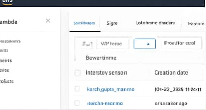
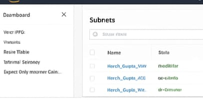

Task 3 - High Availability + Auto Scaling
=========================================

Architecture & Design Approach
------------------------------

I implemented a production-grade, highly available architecture designed to handle 10,000+ concurrent users.

### Traffic Flow Architecture:

Internet Clients
       ↓
   \[ALB in Public Subnets\]
       ↓
   \[Target Group\]
       ↓
\[EC2 Instances in Private Subnets via ASG\]
       ↓
   \[Nginx Web Server\]

### Key Design Decisions:

1.  **Load Balancer Strategy**
    *   Internet-facing Application Load Balancer (ALB) in public subnets
    *   Handles HTTP traffic on port 80
    *   High availability across AZs
2.  **Private Subnet Architecture**
    *   EC2 instances run in private subnets
    *   Only ALB → EC2 traffic allowed
    *   Internet access via NAT Gateway for updates
3.  **Auto Scaling Group Configuration**
    *   Min: 2 instances
    *   Desired: 2 instances
    *   Max: 3 instances
    *   Multi-AZ deployment
4.  **Health Management**
    *   ALB health checks (30 sec)
    *   Auto replacement of failed instances
5.  **Scaling Policies**
    *   Scale Up: CPU > 70% for 2 minutes
    *   Scale Down: CPU < 30% for 2 minutes
    *   5-minute cooldown
6.  **Security Implementation**
    *   ALB SG open on ports 80/443
    *   EC2 SG only allows ALB traffic
    *   Encrypted EBS, IAM roles applied

Traffic Flow & Routing
----------------------

1\. User connects to ALB DNS
2. ALB distributes across public subnets (ap-south-1a & 1b)
3. ALB forwards to target group on port 80
4. Private EC2 instances receive traffic
5. Nginx responds with web/resume content
6. Response returns via ALB to client

Deployment Instructions
-----------------------

**Prerequisite:** Task 1 VPC + Subnets must exist

cd 3\_HA\_AutoScaling
terraform init

terraform plan \\
  -var "prefix=Harsh\_Gupta\_" \\
  -var "vpc\_id=vpc-xxxxx" \\
  -var "public\_subnet\_ids=\[\\"subnet-public1\\", \\"subnet-public2\\"\]" \\
  -var "private\_subnet\_ids=\[\\"subnet-private1\\", \\"subnet-private2\\"\]"

terraform apply \\
  -var "prefix=Harsh\_Gupta\_" \\
  -var "vpc\_id=vpc-xxxxx" \\
  -var "public\_subnet\_ids=\[\\"subnet-public1\\", \\"subnet-public2\\"\]" \\
  -var "private\_subnet\_ids=\[\\"subnet-private1\\", \\"subnet-private2\\"\]"

Screenshots to Capture
----------------------

Scaling Test Procedure
----------------------

sudo apt-get install -y stress
stress --cpu 4 --timeout 5m

Monitoring & Observability
--------------------------

*   CloudWatch alarms (CPU high/low)
*   ALB target group health
*   EC2 + ASG metrics

Cost Optimization
-----------------

*   Minimum 2 instances
*   Free tier t2.micro
*   ASG prevents over-provisioning

Cleanup
-------

terraform destroy \\
  -var "prefix=Harsh\_Gupta\_" \\
  -var "vpc\_id=vpc-xxxxx" \\
  -var "public\_subnet\_ids=\[\\"subnet-public1\\", \\"subnet-public2\\"\]" \\
  -var "private\_subnet\_ids=\[\\"subnet-private1\\", \\"subnet-private2\\"\]"

Key HA Features
---------------

*   Multi-AZ deployment
*   Automatic instance replacement
*   Dynamic scaling
*   Health-based ALB routing
*   Encrypted data at rest
*   Monitoring via CloudWatch
*   SG-based access control
*   User-data automated updates
*   Instance metadata included
